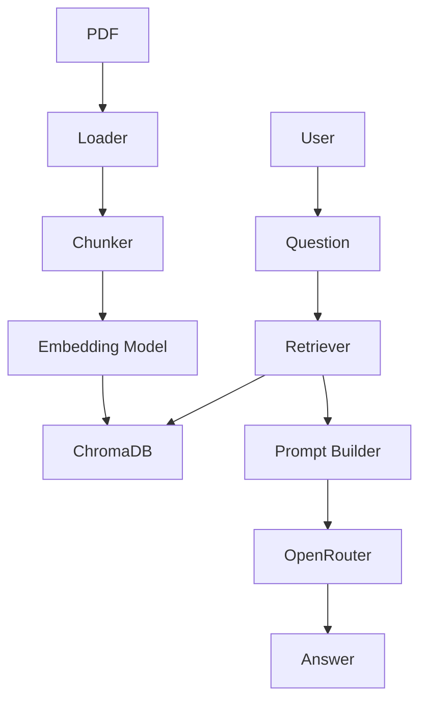

# Simple RAG Application

A simple, educational Retrieval Augmented Generation (RAG) project built using Python, ChromaDB, OpenAI embeddings, and the OpenAI-compatible OpenRouter API.

This project is intentionally lightweight and readable. It is designed to help a developer understand each step in a RAG pipeline without using advanced frameworks or enterprise abstractions.

## Overview

This application demonstrates the core flow of a document-based RAG system:

1. Load a PDF file
2. Extract text from its pages
3. Split text into chunks
4. Generate embeddings for each chunk
5. Store embeddings in ChromaDB
6. Search for relevant chunks using similarity search
7. Build a prompt with retrieved context
8. Send the prompt to OpenRouter
9. Return an answer with source page references

## Architecture Diagram



## Folder Structure

```text
simple-rag/
├── app/
│   ├── config.py
│   ├── loader.py
│   ├── chunker.py
│   ├── embeddings.py
│   ├── vectordb.py
│   ├── llm.py
│   ├── prompts.py
│   ├── models.py
│   └── utils.py
├── docs/
├── vector_db/
├── ingest.py
├── chat.py
├── requirements.txt
├── README.md
├── .env.example
├── .gitignore
└── .venv/
```

## Installation

### 1. Create a virtual environment

```bash
python3 -m venv .venv
source .venv/bin/activate
```

### 2. Install dependencies

```bash
pip install -r requirements.txt
```

### 3. Configure environment variables

Copy the example file and fill in your keys:

```bash
cp .env.example .env
```

Then update the values in .env:

```env
OPENROUTER_API_KEY=your_key_here
OPENROUTER_MODEL=anthropic/claude-sonnet-4
OPENAI_API_KEY=your_key_here
OPENAI_EMBEDDING_MODEL=text-embedding-3-small
CHROMA_DB_PATH=vector_db
COLLECTION_NAME=documents
TOP_K=3
```

## How to Ingest Documents

Run the ingestion script:

```bash
python ingest.py
```

When prompted, enter the PDF path, for example:

```text
Enter PDF path: docs/hr_policy.pdf
```

This will:

- read the PDF
- extract text
- split into chunks
- generate embeddings
- save vectors to ChromaDB

## How to Ask Questions

Run the chat script:

```bash
python chat.py
```

When prompted, enter a question such as:

```text
Enter your question: How many annual leaves are allowed?
```

The application will:

- generate an embedding for the question
- search the vector database
- retrieve the top chunks
- build a prompt with document context
- call OpenRouter
- display the answer and source information

## Example Output

```text
Answer
Employees receive 20 annual paid leaves.

Sources
HR_Policy.pdf
Page 12
Similarity
0.94
```

## Screenshots

Placeholder screenshots for future documentation:

- PDF ingestion prompt
- ChromaDB storage success
- Chat question and answer output

## Future Improvements

- Add support for multiple documents
- Add a document list view
- Add a cleaner CLI interface
- Add chunk metadata display in the answer output
- Add a basic evaluation/test suite
- Add document deletion or refresh workflows

## Troubleshooting

### OpenRouter errors

- Check that OPENROUTER_API_KEY is valid
- Confirm the model name is set in OPENROUTER_MODEL
- Verify the base URL is correctly set in the client code

### OpenAI embedding errors

- Ensure OPENAI_API_KEY is set
- Check that OPENAI_EMBEDDING_MODEL is valid
- Confirm your provider supports the chosen model

### ChromaDB issues

- Make sure the vector_db folder exists and is writable
- Delete the database folder if you want to reset the knowledge base
- Verify the CHROMA_DB_PATH environment variable is correct

### PDF extraction problems

- Ensure the file is a valid PDF
- Check that the document path is correct
- Confirm the file is not empty

## Blog Post

A detailed blog-style write-up covering the objective, problem statement, RAG solution, architecture, and code walkthrough is available in [docs/rag_poc_blog.md](docs/rag_poc_blog.md).

## Notes

This project is intentionally designed for learning and readability. It does not aim to be a production-grade RAG system, but it covers the core concepts that matter most when learning how retrieval and generation work together.
