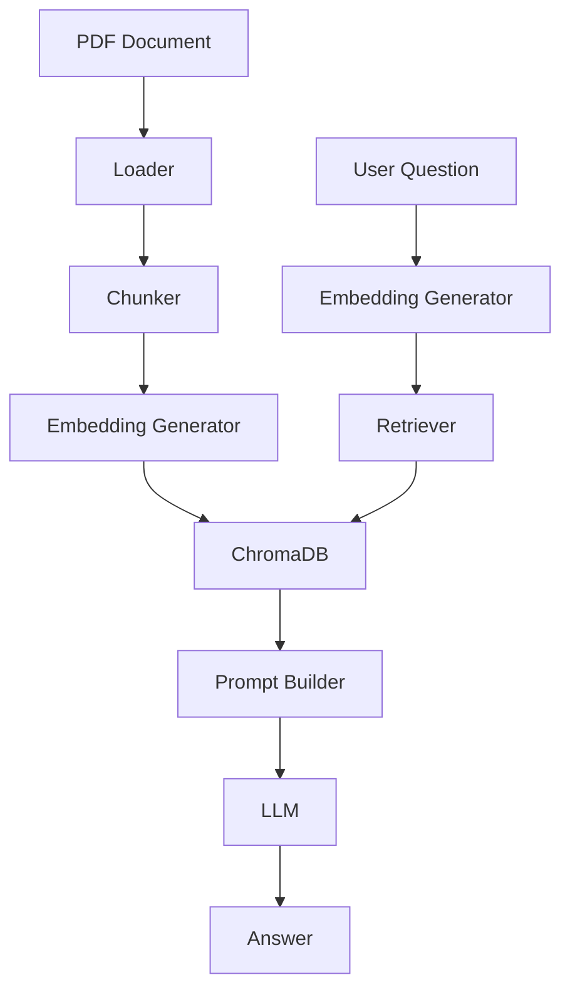

# Building a Simple RAG POC in Python

## Objective

The goal of this project is to demonstrate how a Retrieval-Augmented Generation (RAG) system works in a simple, understandable, and practical way. Instead of relying on heavy frameworks or complex agent orchestration, this POC shows the core pipeline step by step:

1. Load a PDF document
2. Extract text from its pages
3. Split the text into meaningful chunks
4. Generate embeddings for those chunks
5. Store them in a vector database
6. Retrieve relevant chunks for a user question
7. Build a prompt with the retrieved context
8. Send the prompt to an LLM and return an answer

This project is intentionally educational. It is designed for developers who want to understand the mechanics of RAG without getting lost in abstraction.

## Problem

Traditional keyword-based search is often not enough when users ask natural language questions over long documents. A simple search engine may find the right file, but it may miss the semantic meaning of the user’s query.

For example, if a user asks, “What is the leave policy for new employees?”, a keyword-based system may fail to connect that question to a paragraph about “annual paid leave” or “joining benefits.”

This is where RAG becomes valuable. Instead of depending only on exact keyword matches, RAG uses embeddings to find semantically similar content and then gives that information to a language model. The result is more accurate and more context-aware answers.

## RAG Solution Explanation

RAG combines two powerful ideas:

- Retrieval: find the most relevant chunks of information from a document store
- Generation: use an LLM to answer the question based on that retrieved context

The system works like this:

- A document is loaded and converted into plain text.
- The text is divided into smaller chunks.
- Each chunk is converted into an embedding vector.
- These vectors are stored in a vector database such as ChromaDB.
- When a question arrives, the question itself is embedded.
- The system searches the vector database to find the nearest chunks.
- Those chunks are passed into an LLM prompt.
- The LLM answers the question using the retrieved context.

This approach is useful because it grounds the answer in source material rather than forcing the model to rely only on its pre-trained knowledge.

## POC Details and Architecture

This repository implements a lightweight RAG POC with a very simple architecture.

### High-Level Architecture



### Components

- Loader: reads the PDF and extracts text from each page
- Chunker: splits large text into smaller chunks
- Embeddings: creates vector representations of text
- Vector DB: stores and retrieves chunks by similarity
- Prompt Builder: creates a context-rich prompt for the LLM
- LLM: generates the final answer

### Flow of the POC

1. The user runs the ingestion script.
2. The PDF is loaded and chunked.
3. Each chunk is embedded and stored in ChromaDB.
4. The user asks a question through the chat script.
5. The question is embedded and used to search the vector database.
6. Relevant context is retrieved and passed to the LLM.
7. The final answer is printed with source information.

## Major Code Snippets and Explanation

### 1. PDF Loading

File: [app/loader.py](../app/loader.py)

This module is responsible for reading a PDF and extracting text from each page. It uses the PyPDF library to open the file and return a list of page strings.

```python
reader = PdfReader(str(pdf_file))
for page in reader.pages:
    text = page.extract_text() or ""
    cleaned_text = " ".join(text.split())
    pages.append(cleaned_text)
```

Why it matters:
- The loader creates the raw text foundation for the rest of the pipeline.
- It isolates document parsing from chunking and retrieval logic.

### 2. Chunking

File: [app/chunker.py](../app/chunker.py)

The chunker takes the extracted pages and splits them into smaller text blocks. This is important because very large documents are hard to embed and retrieve efficiently.

```python
splitter = RecursiveCharacterTextSplitter(
    chunk_size=chunk_size,
    chunk_overlap=chunk_overlap,
    length_function=len,
    separators=["\n\n", "\n", " ", ""],
)
```

Why it matters:
- Chunk size controls retrieval quality and context length.
- Overlap helps preserve continuity between adjacent chunks.

### 3. Embedding Generation

File: [app/embeddings.py](../app/embeddings.py)

This module converts text chunks into vector embeddings. In this POC, the local embedding path uses SentenceTransformer-style logic when available, and falls back gracefully when a model download is not possible.

```python
def generate_embedding(text: str, model: str | None = None, force_local: bool = True) -> List[float]:
    model_name = model or settings.embedding_model
    try:
        model = _get_local_sentence_model(model_name)
        embedding = model.encode(text, convert_to_numpy=False)
        return [float(value) for value in embedding]
    except Exception:
        return _fallback_embedding(text)
```

Why it matters:
- Embeddings allow the system to search by meaning rather than literal keyword matching.
- This is the backbone of semantic retrieval.

### 4. ChromaDB Storage and Retrieval

File: [app/vectordb.py](../app/vectordb.py)

This module stores embeddings and later retrieves the most relevant chunks based on similarity. ChromaDB is used as the persistent vector store.

```python
collection.add(
    ids=ids,
    documents=documents,
    embeddings=embeddings,
    metadatas=metadatas,
)
```

```python
results = collection.query(
    query_embeddings=[query_embedding],
    n_results=limit,
    include=["documents", "metadatas", "distances"],
)
```

Why it matters:
- The vector database makes similarity search efficient and persistent.
- It enables the RAG system to retrieve relevant evidence for a question.

### 5. Prompt Construction

File: [app/prompts.py](../app/prompts.py)

The prompt builder creates a clear instruction for the LLM. It tells the model to answer only from the supplied context and explicitly avoid hallucination.

```python
template = """You are an enterprise document assistant.

Answer ONLY using the supplied context.

If the answer cannot be found in the supplied context, respond with:

\"I could not find this information in the uploaded document.\"

Never hallucinate.

Always mention the source page.
"""
```

Why it matters:
- Prompt design has a direct impact on answer quality.
- Good prompts reduce the chance of the model inventing facts.

### 6. LLM Interaction

File: [app/llm.py](../app/llm.py)

This module sends the final prompt to the model and returns the answer. It uses a generic OpenAI-compatible client setup so the project can be adapted to different backends.

```python
response = client.chat.completions.create(
    model=settings.llm_model,
    messages=[{"role": "user", "content": prompt}],
)
```

Why it matters:
- This is the generation step of the RAG pipeline.
- It converts retrieved context into a useful human-readable answer.

### 7. End-to-End Execution

Files: [ingest.py](../ingest.py) and [chat.py](../chat.py)

The ingestion script runs the document pipeline end to end. The chat script performs the retrieval and generation flow for a user question.

```python
chunks = chunk_pages(pages, filename=pdf_path, chunk_size=1000, chunk_overlap=200)
embeddings = generate_embeddings_for_chunks(chunks)
store_chunks(chunks, embeddings)
```

```python
question_embedding = generate_embedding(question)
results = search_similar_chunks(question_embedding, limit=settings.top_k)
```

Why it matters:
- These scripts show the overall user experience of the POC.
- They connect all modules into a coherent workflow.

## Why This POC Is Useful

This project is valuable because it shows the full lifecycle of a RAG system in a compact form:

- It is easy to understand.
- It is modular and readable.
- It can be extended later with better chunking, better embeddings, or more advanced retrieval strategies.
- It provides a practical foundation for learning and experimentation.

## Conclusion

This simple RAG POC demonstrates that a document-based question-answering system can be built with a handful of well-defined steps. The key idea is to retrieve the most relevant information first, then use an LLM to craft an answer grounded in that evidence.

For developers learning RAG, this project offers a strong starting point. It keeps the implementation approachable while still covering the most important concepts behind retrieval and generation.
